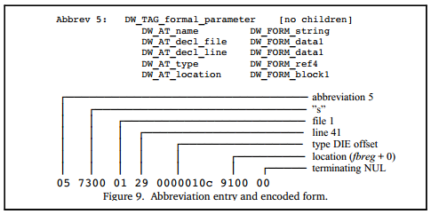

### 5.3.4 Data Encoding 

Dwarf data conceptually is a tree of DIE, DIE may has children or siblings, each DIE may has several attributes. Dwarf data is unwieldly, so it must be compressed to reduce the size, then the compressed data is stored into the object file. 

Dwarf provides serveral methods to compress the data. 

- Use prefix traversal to flatten the tree  
Prefix traversal the Dwarf tree, the accessed tree node DIE is stored. By this way, the links between DIE and its children DIEs and sibling DIEs are eliminated. When reading  Dwarf data, maybe jumping to the next sibling DIE is needed, the sibling DIE can be stored as an attribute in current DIE. 

- Use abbreviation to avoid store duplicated values  
Instead of storing the value of the TAG and attribute-value pairs, only an index into a table of abbreviations is stored, followed by attributes codes. Each abbreviation gives the TAG value, a flag indicating whether the DIE has children, and a list of attributes with the type of value it expects. 

    Figure 9 is an example of using abbreviation:

    

Less commonly used are features of Dwarf 3 and 4 which allow references from one compilation unit to the Dwarf data stored in another compilation unit.

