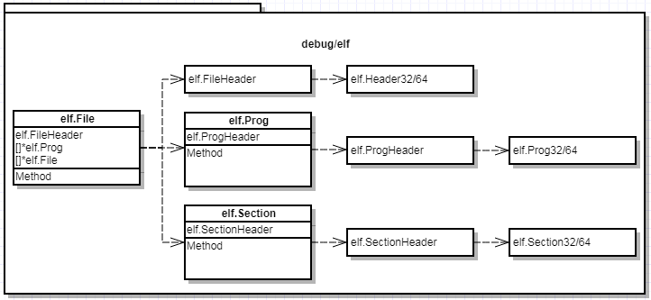

### Symbol Table, LinenumTable

#### debug/elf

ELF, short for Executable and Linkable Format, is a common standard file format for executable files, object code, shared libraries, and core dumps. It is commonly used in Unix and Linux.

ELF format is as following:


 

Debug/elf, this package provides a way to read the ELF File Header, Program Header Table, Section Header Table of elf file.

 

1)    elf.go, defines the constants and datatype for primitive ELF File Header, Program Header Table, Section Header Table, etc.

2)    file.go, beyond of elf.go, defines the File, File Header, Prog, ProgHeader, Section, SectionHeader, etc.

These datatype’s relation is as following:



 

#### debug/gosym

debug/gosym, this package provides a way to build Symbol Table and LineTable, etc.

 

1)    pclintab.go, it builds the line table *gosym.LineTable*, which handles LineToPC, PCToLine, etc.

2)    symtab.go, it builds the symbol table *gosym.Table*, which handles LookupSym, LookupFunc, SymByAddr, etc. Through the lookuped symbol, we can also retrieve some important information, such as retrieving line table from a Func.

 

#### debug/dwarf

Dwarf v2 aims to solve how to represent the debugging information of all programming languages, there’s too much to introduce it. Dwarf debugging information may be generated and stored into many debug sections, but in package debug/dwarf, only the following debug sections are handled:

1)    .debug_abbrev

2)    .debug_info

3)    .debug_str

4)    .debug_line

5)    .debug_ranges

6)    .debug_types

 

1)    const.go, it defines the constansts defined in Dwarf, including constants for tags, attributes, operation, etc.

2)    entry.go, it defines a DIE parser, type *dwarf.Entry* abstracts a DIE entry including 3 important members, Tag(uint32), Field{Attr,Val,Class}, Children(bool).

It defines a DIE Reader for traversing the .debug_info which is constructed as a DIE tree via:

```go
f, e := elf.Open(elf)
dbg, e := f.DWARF()
r := dbg.Reader()

for {
	entry, err := r.Next()

	if err != nil || entry == nil {
		break
	}

	//do something with this DIE*
	//…
}
```

3)    line.go, each single compilation unit has a .debug_line section, it contains a sequence of LineEntry structures. In line.go, a LineReader is defined for reading this sequence of LineEntry structures.

`func (d \*dwarf.Data) LineReader(cu \*Entry) (\*LineReader, error)`, the argument must be a DIE entry with tag TagCompileUnit, i.e., we can only get the LineReader from the DIE of compilation unit.

```go
f, e := elf.Open(elf)
dbg, e := f.DWARF()
r := dbg.Reader()

for {
	entry, _ := r.Next()
	if err != nil || entry == nil {
		break;
	}

	// read the line table of this DIE

	lr, _ := dbg.LineReader(entry)
	if lr != nil {
		le := dwarf.LineEntry{}
		for {
			e := lr.Next(&le)
			if e == io.EOF {
				break;
			}
		}
	}
}
```

4)    type.go, Dwarf type information structures.

5)    typeunit.go, parse the type units stored in a Dwarf v4 .debug_types section, each type unit defines a single primary type and an 8-byte signature. Other sections may then use formRefSig8 to refer to the type.

6)    unit.go, Dwarf debug info is split into a sequence of compilation units, each unit has its own abbreviation table and address size.
