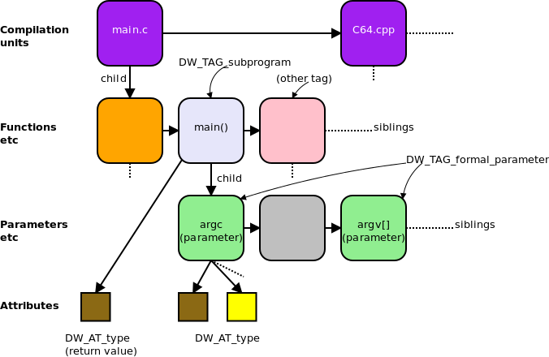

### 5.3.3 描述可执行代码

#### 5.3.3.1 函数（子程序）

##### 5.3.3.1.1 subprogram

函数（也称为子程序）可以有返回值，也可以没有。DWARF使用DIE`DW_AT_type`来表示这两种情况。 该DIE具有一个名称，一个三元组表示的源代码中的位置，还有一个指示该子程序是否在外部（编译单元）可见的属性。

> 在不同的编程语言中，函数有不同的术语表示，如routine, subroutine, subprogram, function, method or procedure，参考：https://en.wikipedia.org/wiki/Subroutine。这里不深究细节上的差异，先明白DW_AT_subprograme是用来描述函数的就可以。

##### 5.3.3.1.2 subprogram地址范围

函数（子程序）DIE具有属性 `DW_AT_low_pc`、`DW_AT_high_pc`，以给出函数占用的内存地址空间的上下界。 在某些情况下，函数的内存地址可能是连续的，也可能不是连续的。如果不连续，则会有一个内存范围列表。一般DW_AT_low_pc的值为函数入口点地址，除非明确指定了另一个地址。

##### 5.3.3.1.3 subprogram返回值类型

函数（子程序）的返回值类型由DIE DW_TAG_subprogram中的属性 `DW_AT_type` 描述。 如果没有返回值，则此属性不存在。如果在此函数的相同范围内定义了返回类型，则返回类型DIE将作为此函数DIE的兄弟DIE。

##### 5.3.3.1.4 subprogram形参列表

函数可能具有零个或多个形式参数，这些参数由DIE `DW_TAG_formal_parameter` 描述，这些形参DIE的位置被安排在函数DIE之后，并且各形参DIE的顺序按照形参列表中出现的顺序，尽管参数类型的DIE可能会散布。 通常，这些形式参数存储在寄存器中。

##### 5.3.3.1.5 subprogram局部变量

函数主体可能包含局部变量，这些变量由DIE `DW_TAG_variables` 在形参DIE之后列出。 通常这些局部变量在栈中分配。

##### 5.3.3.1.6 词法块

大多数编程语言都支持词法块，函数中可能有一些词法块，可以用DIE`DW_TAG_lexcical_block`来描述。 词法块也可以包含变量和词法块DIE。

下面是一个描述C语言函数的示例：

生成的DWARF调试信息如下所示：

参考5.3.3.1.1~5.3.3.1.6中介绍的内容，这个示例是非常好理解的。

#### 5.3.3.2 编译单元

大多数程序包含多个源文件。 在生成程序时，每个源文件都被视为一个独立的编译单元，并被编译为独立的*.o文件（例如C），然后链接器会将这些目标文件、系统特定的启动代码、系统库链接在一起以生成完整的可执行程序 。

DWARF中采用了C语言中的术语“编译单元（compilation unit）”作为DIE的名称 `DW_TAG_compilation_unit`。 DIE包含有关编译的常规信息，包括源文件对应的目录和文件名、使用的编程语言、生成DWARF信息的生产者，以及有助于定位行号和宏信息的偏移量等等。

如果编译单元占用了连续的内存（即，它会被装入一个连续的内存区域），那么该单元的低内存地址和高内存地址将有值，即低pc和高pc属性。 这有助于调试器更轻松地确定特定地址处的指令是由哪个编译单元生成。

如果编译单元占用的内存不连续，则编译器和链接器将提供代码占用的内存地址列表。

每个编译单元都会有一个“**公共信息条目（Common Information Entry）**”表示。

#### 5.3.3.3 关于go

最后，关于golang的一点特殊说明。

下图展示的是C语言中采取的方式，C语言编译器采取了这里DWARF标准推荐的方式，如形参列表通过DW_TAG_former_parameter来说明，返回值类型通过DW_AT_type来说明，如果没有返回值则无此属性。

但是，golang语言和C相比有点特殊，golang要支持多值返回，所以仅用DW_AT_type是无法对返回值列表进行充分描述的。

我们可以写测试程序验证，golang v1.15中并没有使用DWARF规范中推荐的DW_AT_type来说明返回值类型。golang中对返回值的表示，和参数列表中参数一样，仍然是通过DW_TAG_formal_parameter来描述的，但是会通过属性DW_AT_variable_parameter来区分参数属于形参列表或返回值列表，为0表示是形参，为1表示是返回值。

