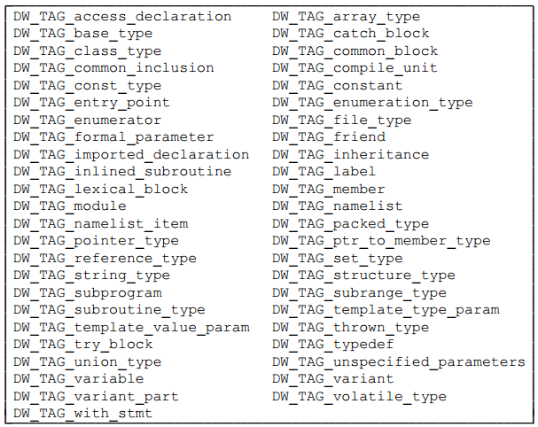
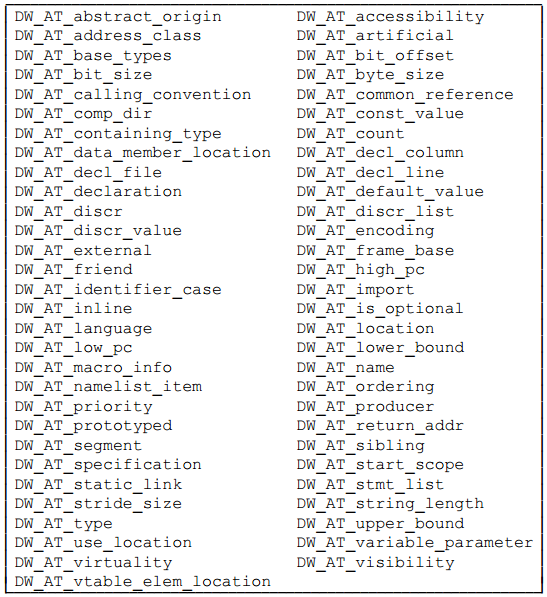

### 5.3.1 DIE介绍

每个调试信息条目（DIE）都由一个tag以及一系列attributes构成。

- tag指明了该DIE描述的程序构造所属的类型，如变量、数据类型、函数等；
- attributes定义了该DIE的一些具体特征，如变量所属的数据类型；

以Linux下ELF文件格式为例，调试信息条目多将其存储在.debug_info和.debug_types中，如果涉及到压缩会存储到.zdebug_info和.zdebug_types中。

#### 5.3.1.1 DIE的Tag

Tag，其名称以DW_TAG开头，它指明了DIE描述的程序构造所属的类型，下面表格中整理了DWARF v2中定义的Tag，各个Tag的具体含义可以参考DWARF标准中描述。

> DWARF v3 中新增了如下Tag：
>
> DW_TAG_condition, DW_TAG_dwarf_procedure, DW_TAG_imported_module, DW_TAG_imported_unit, DW_TAG_interface_type, DW_TAG_namespace, DW_TAG_partial_unit, DW_TAG_restrict_type, DW_TAG_shared_type, DW_TAG_unspecified_type.

#### 5.3.1.2 DIE的Attributes

Attribute，其名称以DW_AT开头，它进一步补充了DIE要描述的程序构造的信息。

一个attribute可能有各种类型的值：常量（如函数名称），变量（如函数的开始地址），对另一个DIE的引用（如函数返回值对应的类型DIE）。

属性的值，可能属于一种或多种取值类别，每种取值类别又可能有多种表示方式。

例如，某些属性值包含了一些某种常量类型的数据，，但是，常量数据也有多种表示形式（1、2、4、8字节甚至可变长度的数据）。 属性的任何类型实例的特定表示，都与属性名称一起被编码，方便更好地理解、解释DIE的含义。

下表列出了DWARF v2中定义的attributes：

>DWARF v3 中新增了如下attributes：
>
>DW_AT_allocated, DW_AT_associated, DW_AT_binary_scale, DW_AT_bit_stride, DW_AT_byte_stride, DW_AT_call_file, DW_AT_call_line,  DW_AT_call_column, DW_AT_data_location, DW_AT_decimal_scale, DW_AT_decimal_sign, DW_AT_description, DW_AT_digit_count, DW_AT_elemental, DW_AT_endianity, DW_AT_entry_pc, DW_AT_explicit, DW_AT_extension, DW_AT_mutable, DW_AT_object_pointer, DW_AT_prototyped, DW_AT_pure, DW_AT_ranges, DW_AT_recursive, DW_AT_small, DW_AT_threads_scaled, DW_AT_trampoline, DW_AT_use_UTF8.

attribute取值可以划分为如下几种类型：

1. **Address**, 引用被描述程序的地址空间的某个位置；

2. **Block**, 未被解释的任意数量的字节数据块；

3. **Constant**, 1、2、4、8字节未被解释的数据，或者以LEB128形式编码的数据；

4. **Flag**, 指示属性存在与否的小常数；

5. **lineptr**, 引用存储着行号信息的DWARF section中的某个位置；

6. **loclistptr**, 引用存储着位置列表的DWARF section中的某个位置，某些对象的内存地址在其生命周期内会发生移动，需要通过位置列表来进行描述；

7. **macptr**, 引用存储着macro信息的DWARF section中的某个位置；

8. **rangelistptr**, 引用存储着非相邻地址区间信息的DWARF section中的某个位置；

9. **Reference**, 引用某个描述program的DIE；

   > 根据被引用DIE所在的编译单元与引用发生的编译单元是否相同，可以划分为两种类型的references：
   >
   > - 第一种引用，被引用的DIE所在的编译单元与当前编译单元是同一个，通过相对于该编译单元起始位置的偏移量来引用该DIE；
   > - 第二种引用，被引用的DIE所在的编译单元可以在任意编译单元中，不一定与当前编译单元相同，通过被引用DIE的偏移量来引用该DIE；

10. **String**, 以'\0'结尾的字符序列，字符串可能会在DIE中直接表示，也可能通过一个独立的字符串表中的偏移量（索引）来引用。

#### 5.3.1.3 DIEs分类

根据描述信息的不同，可以将所有的DIEs划分为两大类：

1. 描述 **数据 和 类型** 的；
2. 描述 **函数 和 可执行代码** 的；

> 一个DIE可以有父、兄弟、孩子DIEs，DWARF调试信息可以被构造成一棵树，树中每个节点都是一个DIE，多个DIE组合在一起共同描述编程语言中具体的一个程序构造（如描述一个函数的定义）。如果考虑源码中所有的关系的话，那所有的DIEs形成的就是一个森林。

在后面的章节，我们会介绍DIEs的不同类型，然后再深入了解DWARF的其他知识。

