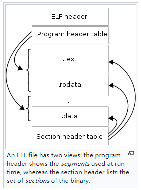

## 符号级调试基础：ELF文件

### ELF文件结构

ELF ([Executable and Linkable Format](https://en.wikipedia.org/wiki/Executable_and_Linkable_Format))，可执行链接嵌入格式，是Unix、Linux环境下一种十分常见的文件格式，它可用于可执行程序、目标文件、共享库、coredump文件等。

ELF文件格式如下，文件开头是ELF Header，剩下的数据部分包括Program Header Table、Section Header Table、Sections，Sections中的数据由Program Header Table、Section Header Table来引用。



这里简单列一下上述关键结构的含义和作用：

- ELF FIle Header，ELF文件头，其描述了当前ELF文件的类型（可执行程序、可重定位文件、动态链接文件、core文件等）、32位or64位寻址、ABI、ISA、程序入口地址、Program Header Table起始地址及元素大小、Section Header Table起始地址及元素大小，等等；
- Program Header Table，它描述了系统如何创建一个程序的进程映像，每个表项都定义了一个segment（段），其中引用了0个、1个或多个section，它们也有自己的类型，如PT_LOAD，表示系统应按照表项中定义好的虚拟地址范围将引用的sections以mmap的形式映射到进程虚拟地址空间，如进程地址空间中的text段、data段；
- Section Header Table，它描述了文件中包含的每个section的位置、大小、类型、链接顺序，等等，主要目的是为了指导链接器进行链接；
- Sections，ELF文件中的sections数据，夹在Program Header Table和Section Header Table中间，由一系列的sections数据构成。

### ELF PRogram Header Table

它定义了程序执行的视图（executable point of view），或者说是loader加载的视图。

从可执行程序角度来看，进程运行时需要了解如何将程序中不同部分，加载到进程虚拟内存地址空间中的不同区域（段，segments）。

Linux下进程地址空间的内存布局，大家并不陌生，如data段、text段，它们其实是由Program Header Table预先定义好的，包括在虚拟内存空间中的位置，以及text段中应该包含哪些sections数据。

以测试程序golang-debugger-lessons/testdata/loop2为例，运行`readelf -l`查看其program header table，共有7个program headers，每个program header在虚拟内存中的地址、每个program header包含的sections，都一览无余。如，最终组织好的text segment包含了如下sections .text .note.go.buildid。

```bash
$ readelf -l testdata/loop2

Elf file type is EXEC (Executable file)
Entry point 0x4647a0
There are 7 program headers, starting at offset 64

Program Headers:
  Type           Offset             VirtAddr           PhysAddr
                 FileSiz            MemSiz              Flags  Align
  PHDR           0x0000000000000040 0x0000000000400040 0x0000000000400040
                 0x0000000000000188 0x0000000000000188  R      1000
  NOTE           0x0000000000000f9c 0x0000000000400f9c 0x0000000000400f9c
                 kk 0x0000000000000064  R      4
  LOAD           0x0000000000000000 0x0000000000400000 0x0000000000400000
                 0x0000000000099294 0x0000000000099294  R E    1000
  LOAD           0x000000000009a000 0x000000000049a000 0x000000000049a000
                 0x00000000000a48c6 0x00000000000a48c6  R      1000
  LOAD           0x000000000013f000 0x000000000053f000 0x000000000053f000
                 0x0000000000015900 0x0000000000048088  RW     1000
  GNU_STACK      0x0000000000000000 0x0000000000000000 0x0000000000000000
                 0x0000000000000000 0x0000000000000000  RW     8
  LOOS+5041580   0x0000000000000000 0x0000000000000000 0x0000000000000000
                 0x0000000000000000 0x0000000000000000         8

 Section to Segment mapping:
  Segment Sections...
   00     
   01     .note.go.buildid 
   02     .text .note.go.buildid 
   03     .rodata .typelink .itablink .gosymtab .gopclntab 
   04     .go.buildinfo .noptrdata .data .bss .noptrbss 
   05     
   06 
```

> 本章稍后会介绍Program Header Table如何指导loader创建进程映像。

### ELF Section Header Table

它定义了程序链接的视图（the linkable point of view），主要是用来指导linker工作。

从链接器角度来看，程序将代码、数据划分成不同的sections，如指令在.text、只读数据在.rodata等。程序中的每个section属于0个、1个或多个segments，每个section在程序运行时会被（或不被）mmap到进程地址空间。

以测试程序golang-debugger-lessons/testdata/loop2测试程序为例，我们来看下其链接器角度的视图，可以看到其包含了25个sections，每个section都有类型、偏移量、大小、链接顺序、对齐等信息，用以指导链接器完成链接操作。

```bash
$ readelf -S testdata/loop2 
There are 25 section headers, starting at offset 0x1c8:

Section Headers:
  [Nr] Name              Type             Address           Offset
       Size              EntSize          Flags  Link  Info  Align
  [ 0]                   NULL             0000000000000000  00000000
       0000000000000000  0000000000000000           0     0     0
  [ 1] .text             PROGBITS         0000000000401000  00001000
       0000000000098294  0000000000000000  AX       0     0     32
  [ 2] .rodata           PROGBITS         000000000049a000  0009a000
       00000000000440c7  0000000000000000   A       0     0     32
       .............................................................
  [ 4] .typelink         PROGBITS         00000000004de2a0  000de2a0
       0000000000000734  0000000000000000   A       0     0     32
  [ 5] .itablink         PROGBITS         00000000004de9d8  000de9d8
       0000000000000050  0000000000000000   A       0     0     8
  [ 6] .gosymtab         PROGBITS         00000000004dea28  000dea28
       0000000000000000  0000000000000000   A       0     0     1
  [ 7] .gopclntab        PROGBITS         00000000004dea40  000dea40
       000000000005fe86  0000000000000000   A       0     0     32
       .............................................................
  [10] .data             PROGBITS         000000000054d4e0  0014d4e0
       0000000000007410  0000000000000000  WA       0     0     32
       .............................................................
  [14] .zdebug_line      PROGBITS         0000000000588119  00155119
       000000000001cc0d  0000000000000000           0     0     1
  [15] .zdebug_frame     PROGBITS         00000000005a4d26  00171d26
       00000000000062e9  0000000000000000           0     0     1
       .............................................................
  [22] .note.go.buildid  NOTE             0000000000400f9c  00000f9c
       0000000000000064  0000000000000000   A       0     0     4
  [23] .symtab           SYMTAB           0000000000000000  001d0000
       0000000000011370  0000000000000018          24   422     8
  [24] .strtab           STRTAB           0000000000000000  001e1370
       00000000000109fb  0000000000000000           0     0     1
Key to Flags:
  W (write), A (alloc), X (execute), M (merge), S (strings), I (info),
  L (link order), O (extra OS processing required), G (group), T (TLS),
  C (compressed), x (unknown), o (OS specific), E (exclude),
  l (large), p (processor specific)
```

现在我们来尝试回答几个读者朋友可能的疑问：

**section与segments隶属关系？**

一个section属于多少个segments，这个由Program Headers定义，以前面示例做参考，go程序中.note.go.buildid就属于两个段，段索引分别为01、02，但是.data就只属于一个段，段索引02。

**section是否会被加载到内存中？**

一个section中数据最终会不会被mmap到进程地址空间，也是由引用它的Program Header的类型决定的，如果Program Header类型为LOAD类型，则会被mmap到进程地址空间，反之则不会。

仍以前面示例做参考，我们发现.gosymtab、.gopclntab所属的段（段索引值 03）是LOAD类型，表示其数据会被加载到内存，这是因为go runtime依赖这些信息来计算stacktrace。

而.note.go.buildid所属的段（段索引 01）为NOTE类型，不会被加载到内存，这种就是给一些外部工具读取使用的。比如方便`go tool buildid <prog>`提取buildid信息，这个其实就是存储在.note.go.buildid section中的。

来验证下，首先通过`go tool buildid`来提取buildid信息：

```bash
$ go tool buildid loop
z3BnMb0ZcNprbNCHGFUE/tKoFiTkxKf0367OgPv1m/xoZJRttC9Gcwqc67tiDf/1NjCWH3otcISEg7g8lG7
```

接下来通过`readelf --string-dump=.note.go.buildid <prog>`直接读取ELF文件中的数据：

```bash
String dump of section '.note.go.buildid':
  [     4]  S
  [     c]  Go
  [    10]  z3BnMb0ZcNprbNCHGFUE/tKoFiTkxKf0367OgPv1m/xoZJRttC9Gcwqc67tiDf/1NjCWH3otcISEg7g8lG7
```

结果发现buildid数据是一致的，证实了我们上述判断。

> 本章稍后会介绍Section Header Table如何指导链接器执行链接操作。

### ELF 常见 Sections

ELF文件会包含很多的sections，前面给出的测试实例中就包含了25个sections。

我们先来了解一些常见的sections的作用，为后续加深对linkers、loaders、debgguers工作原理的认识提前做点准备。

- .text: 编译好的程序指令；
- .rodata: 只读数据，如程序中的常量字符串；
- .data：已经初始化的全局变量；
- .bss：未经初始化的全局变量，在ELF文件中只是个占位符，不占用实际空间；
- .symtab：符号表，每个可重定位文件都有一个符号表，存放程序中定义的全局函数和全局变量的信息，注意它不包含局部变量信息，局部非静态变量由栈来管理，它们对链接器符号解析、重定位没有帮助。也要注意，.symtab和编译器中的调试符号无关（如gcc -g生成）；
- .debug_*: 调试信息，调试器读取该信息以支持符号级调试（如gcc -g生成）；
- .strtab：字符串表，内容包括.symtab和.debug_*节中的符号，以及section名；
- .rel.text：一个.text section中位置的列表，当链接器尝试把这个目标文件和其他文件链接时，需要修改这些位置的值，链接之前调用外部函数或者引用外部全局变量的是通过符号进行的，需要对这些符号进行解析、重定位成正确的访问地址。
- .rel.data：引用的一些全局变量的重定位信息，和.rel.text有些类似；

当然除了列出的这些，还有很多其他sections，ELF也允许vendor自定义sections，以支持一些期望的功能，如go语言就添加了.gosymtab、.gopclntab、.note.build.id来支持go运行时的一些操作。

我们来简单介绍下如何查看sections中的内容：

- 查看sections列表 `readelf -S <prog>`

  ```bash
  $ readelf -S testdata/loop2 
  There are 25 section headers, starting at offset 0x1c8:
  
  Section Headers:
    [Nr] Name              Type             Address           Offset
         Size              EntSize          Flags  Link  Info  Align
    [ 0]                   NULL             0000000000000000  00000000
         0000000000000000  0000000000000000           0     0     0
    [ 1] .text             PROGBITS         0000000000401000  00001000
         0000000000098294  0000000000000000  AX       0     0     32
    [ 2] .rodata           PROGBITS         000000000049a000  0009a000
         00000000000440c7  0000000000000000   A       0     0     32
    ...
  ```

- 查看指定section数据 `readelf --string-dump`

  ```bash
  $ readelf --string-dump=.note.go.buildid loop
  
  String dump of section '.note.go.buildid':
    [     4]  S
    [     c]  Go
    [    10]  z3BnMb0ZcNprbNCHGFUE/tKoFiTkxKf0367OgPv1m/xoZJRttC9Gcwqc67tiDf/1NjCWH3otcISEg7g8lG7
  ```

- 查看指定section数据 `readelf --hex-dump`

  ```bash
  $ readelf --hex-dump=.note.go.buildid loop
  
  Hex dump of section '.note.go.buildid':
    0x00400f9c 04000000 53000000 04000000 476f0000 ....S.......Go..
    0x00400fac 7a33426e 4d62305a 634e7072 624e4348 z3BnMb0ZcNprbNCH
    0x00400fbc 47465545 2f744b6f 4669546b 784b6630 GFUE/tKoFiTkxKf0
    0x00400fcc 3336374f 67507631 6d2f786f 5a4a5274 367OgPv1m/xoZJRt
    0x00400fdc 74433947 63777163 36377469 44662f31 tC9Gcwqc67tiDf/1
    0x00400fec 4e6a4357 48336f74 63495345 67376738 NjCWH3otcISEg7g8
    0x00400ffc 6c473700                            lG7.
  ```

- 其他，如`readelf --relocated-dump | --debug-dump`，可以按需选用。

本节ELF内容就先介绍到，在此基础上，接下来的几个小节，我们将依次介绍linker、loader、debugger的工作原理。

### 参考文献

1. Executable and Linkable Format, https://en.wikipedia.org/wiki/Executable_and_Linkable_Format

2. How to Fool Analysis Tools, https://tuanlinh.gitbook.io/ctf/golang-function-name-obfuscation-how-to-fool-analysis-tools

3. Go 1.2 Runtime Symbol Information, Russ Cox, https://docs.google.com/document/d/1lyPIbmsYbXnpNj57a261hgOYVpNRcgydurVQIyZOz_o/pub

4. Some notes on the structure of Go Binaries, https://utcc.utoronto.ca/~cks/space/blog/programming/GoBinaryStructureNotes

5. Buiding a better Go Linker, Austin Clements, https://docs.google.com/document/d/1D13QhciikbdLtaI67U6Ble5d_1nsI4befEd6_k1z91U/view

6. Time for Some Function Recovery, https://www.mdeditor.tw/pl/2DRS/zh-hk

7. Computer System: A Programmer's Perspective, Randal E.Bryant, David R. O'Hallaron, p450-p479

   深入理解计算机系统, 龚奕利 雷迎春 译, p450-p479

8. Learning Linux Binary Analysis, Ryan O'Neill, p14-15, p18-19

   Linux二进制分析, 棣琦 译, p14-15, p18-19

   