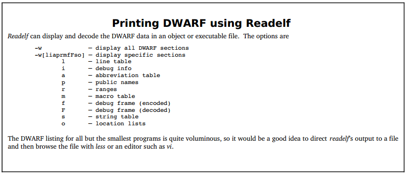

## 总结 

DWARF的基本概念非常简单： 

- 程序被描述为“**DIE节点构成的树**”，以紧凑的语言和与机器无关的方式表示源码中的各种函数、数据和类型；
- “**行号表**”提供了可执行指令地址和生成它们的源码之间的映射关系；
- “**CFI（调用栈帧信息）**”描述了如何虚拟地展开堆栈（virtual unwind）；
- 考虑到DWARF需要针对**多种编程语言**和**不同的机器架构**表达许多不同的细微差别，因此Dwarf中也有很多微妙之处。

以gcc为例，通过选项-g “**gcc -g -c filename.c**” 能够生成DWARF调试信息并将其存储到目标文件filename.o的调试信息相关的section中。

通过使用 “**readelf -w**” 能够读取、显示所有生成的DWARF调试信息，也可以指定特定的section来加载特定的DWARF调试信息，如 “**readelf -wl**” 只加载 .debug_line 行号表信息。

本章已经详细介绍了DWARF对编程语言中不同程序构造的描述，个别的还提供了完整的示例并结合计算过程进行了详细讲解。希望读者已经搞明白了DWARF的大致工作原理。
