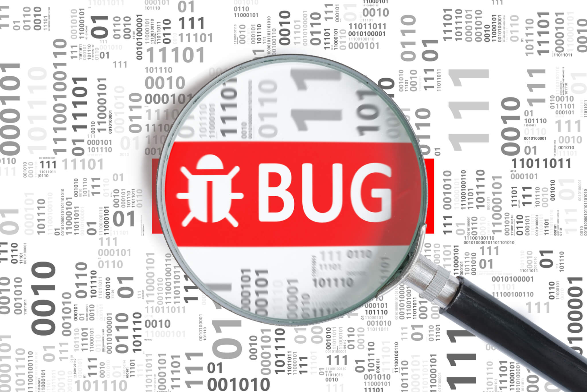

从打孔卡片开始，到机器指令、汇编语言，再到现在五花八门的高级编程语言，编程语言越来越容易理解、使用，编译器、静态分析工具也越来越完善，开发人员对于计算机知识的掌握也越来越牢固，但是依然避免不了写出bug。

犯错误并不可怕，怎么感知到有错误并及时纠正更重要。

人们对错误的理解可能存在误区，即使错误确实存在，也不一定总能表现出其“症状”。就和医生给病人看病一样，如果没有医疗器材辅助医生稳定可靠地复现病人的“症状”，医生也不知道该如何治疗。计算机世界中的bug，也是一样的道理，如果这个bug不能稳定地复现（我们称其为必现、偶现），解决它就会变得困难。

为了更高效地解决bug，通常在bug表现出“症状”时，我们会及时保留问题现场，如隔离有问题的服务实例供开发人员调查，或者生成进程的core文件供后续分析，等等。

及时保留问题现场只是高效解决问题的第一步，还需要有趁手的“兵器”来深入“症状”内部来一探究竟（定位bug）。

有些有经验的开发人员，会考虑检查下错误日志，并走读代码，以此来发现潜在的bug，他们也会建议初级开发人员采用这样的方法来定位问题。实践证明，这是一个比较高效的方式。

也有些极端的声音，如“定位问题，你不需要一个调试器”。但是遗憾的是，并非所有的bug都这么容易被定位。有些bug可能潜在地更深，如bug隐藏在外部依赖库中，或者某种特殊边界条件才能触发，而这些边界条件在程序设计的时候压根可能未被考虑过。

我要表达的是，根据具体问题选择合适的定位方法，而非“你不需要一个调试器”。我遇到过很多复杂的case，如果没有调试器将会花费我更多的时间。

有意思的是，调试器并不只是一个简单的工具，它的功能也不只是定位bug这么单一，它的执行方式决定了，你可以用它来跟踪、学习几乎任何系统、算法的执行过程，它带给你的将是一个知识的宝藏。

考虑到本书及配套的调试器实现demo是出于教学目的的，作者认为在开始编码之前，先交代下整体的功能性、非功能性要求以及概要设计、详细设计非常重要，我们在后续小节中进行内容展开时，读者朋友们就能知道我们为什么安排这些内容，它的意义是什么以及与相互之间的联系是什么，也有助于根据个人掌握情况选择性的阅读。

